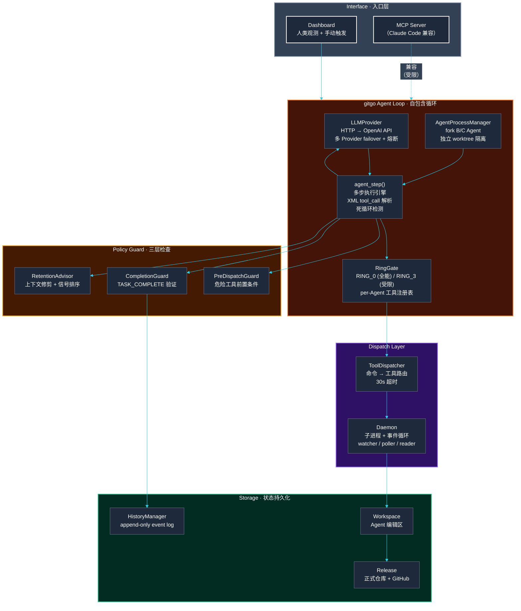

# gitgo — Agent 编排系统

多 Agent 并行 | 长任务可靠 | 自定义工作流

gitgo 是运行在项目内的 Agent 编排层。类比 OS 管理硬件资源，gitgo 管理 Agent 的生命周期、任务分发、状态持久化和治理策略。

## 快速开始

```bash
pip install -r requirements.txt
cd cli/dashboard && bun install
```

```bash
# 启动 MCP Server（Claude Code 连接）
python mcp_server.py

# 启动 Dashboard（人类观测面板）
cd cli/dashboard && bun run src/main.tsx

# 运行测试
pytest tests/ -q    # 501 passed, 1 skipped
```

## 架构

gitgo 内置完整的 Agent 循环——自包含的 LLM 调用、工具分发、权限检查、多步执行引擎。
MCP 接口为兼容 Claude Code 保留，但完整的治理编排能力通过原生协议发挥。



## 核心概念

| 概念 | 说明 |
|------|------|
| **Agent Loop** | 自包含的 Agent 循环：LLM 调用 → XML tool_call 解析 → RingGate 权限 → 工具执行 → 下一轮 LLM 调用 |
| **LLMProvider** | 内置 HTTP 调用器，直连 OpenAI API。多 Provider failover + 熔断 + 指数退避 |
| **RingGate** | 两层权限：RING_0（全能）/ RING_3（受限），per-Agent 工具注册表 |
| **AgentProcessManager** | 多 Agent 并行 fork，独立 worktree 隔离，最大深度 2 |
| **Policy Guard** | 三层检查：PreDispatch（前置条件）+ Completion（完成验证）+ Retention（上下文修剪）|
| **MCP Server** | 为 Claude Code 兼容保留。47 个工具，但受限——完整治理编排需原生协议 |
| **Dashboard** | Ink 终端 UI：进程列表 + 聊天 + LLM 配置 + 治理 Tab |
| **HistoryManager** | Append-only governance event log，完整审计追踪 |

## 能力矩阵

### Agent 编排（gitgo Loop 自主执行）

| 能力 | 说明 |
|------|------|
| 多 Agent 并行 fork | AgentProcessManager 管理 B/C Agent 池，独立 worktree，RingGate 权限隔离 |
| 多步执行循环 | agent_step()：LLM → tool_call 解析 → dispatch → 检查 → 循环，可配 max_steps |
| 上下文管理 | 自动检测上下文使用率，>80% 修剪，>90% LLM 摘要压缩 |
| 死循环检测 | 连续无工具调用的纯文本响应 → KILL |
| LLM Failover | 多 Provider 链式 fallback，每 Provider 独立熔断器，指数退避重试 |

### MCP 工具（Claude Code 兼容接口）

| MCP Tool | 说明 |
|----------|------|
| `gitgo_fork_agent` | 派生 Agent，独立 worktree |
| `gitgo_agent_chat` | 触发 Agent 循环执行 |
| `gitgo_loop_status` | 查询 Agent 状态 + 资源 |
| `gitgo_round_complete` | Agent 交付，Gate 检查 |

### 治理策略
| MCP Tool | 说明 |
|----------|------|
| `gitgo_policy_check` | 手动触发策略引擎 |
| `gitgo_contract_show` / `_update` | 项目合约管理 |
| `gitgo_lesson_list` / `_verify` / `_harvest` | 知识传承系统 |
| `gitgo_identity_check` | 身份完整性检测 |

### LLM 配置
| MCP Tool | 说明 |
|----------|------|
| `gitgo_llm_status` | 查看所有 Provider |
| `gitgo_llm_save` | 添加/更新 Provider |
| `gitgo_llm_switch` | 切换 active provider |
| `gitgo_llm_delete` | 删除 Provider |

### Git 工作流
| MCP Tool | 说明 |
|----------|------|
| `gitgo_scan` | 文件变更扫描（SHA256 + EOL 归一化） |
| `gitgo_sync` | 同步到 release（Gate A） |
| `gitgo_push` | 推送到 GitHub（Gate B） |
| `gitgo_trial_*` | 外部代码 triage（accept/promote/discard） |

## 项目结构

```
gitgo/
├── backend/                   # 引擎层
│   ├── core/                  #   Agent Loop / Policy Engine / Dispatch / Steps
│   │   ├── loop/              #   Agent 生命周期（context / gate / llm / manager）
│   │   ├── daemon/            #   守护进程 + DaemonClient（subprocess 通信）
│   │   ├── dispatch/          #   ToolDispatcher（MCP → Daemon 命令路由）
│   │   ├── policy/            #   Policy Engine 可插拔策略
│   │   ├── steps/             #   纯函数管线（scan / commits / sync）
│   │   ├── knowledge/         #   Lesson 知识传承系统
│   │   ├── identity/          #   Identity Guard 完整性检测
│   │   ├── governance/        #   质量度量 + 模式检测
│   │   ├── operations/        #   git / scan / sync / security
│   │   ├── fact/              #   模式匹配
│   │   ├── cache/             #   文件哈希缓存
│   │   ├── sync_session.py    #   状态机（18 step_* 方法）
│   │   ├── history.py         #   HistoryManager（append-only event log）
│   │   ├── contract.py        #   项目合约 + 漂移检测
│   │   ├── llm_config.py      #   LLMConfigManager（多 Provider CRUD）
│   │   ├── authorship.py      #   AI 痕迹清洗
│   │   └── template_manager.py #  Commit 模板系统
│   ├── adapters/              #   Local / SSH / SMB 三实现
│   ├── models/                #   数据模型
│   └── remote/                #   GitHub / GitLab API
├── cli/                       # CLI verbs
│   └── dashboard/             #   Ink 终端 Dashboard（TypeScript + Bun）
├── mcp_server.py              # FastMCP server（47 tools）
├── mcp_tools/                 # MCP 工具实现（loop / llm_config / daemon_registry ...）
├── frontend/                  # Qt GUI（搁置）
├── tests/                     # 501 tests + 1 skip
└── docs/                      # VERSION / CLAUDE.md / HANDOFF / iterations
```

## 版本

最新 **v0.35**。详见 [VERSION.md](docs/VERSION.md)。

| 版本 | 里程碑 |
|------|--------|
| v0.10–v0.25 | Foundation: Governance + Identity + Contract + Lesson + State Convergence |
| v0.26–v0.30 | Runtime + Policy Engine + Dashboard + Dispatch Layer + Agent Loop |
| v0.31–v0.33 | Dashboard 完善 + 技术报告 + P0 修复 |
| v0.34 | 系统整合：原生 Task 命令 + 断裂修复 + Dashboard 双路径 |
| **v0.35** | **Knowledge System 三期 + TestDataFactory + 501 测试** |
