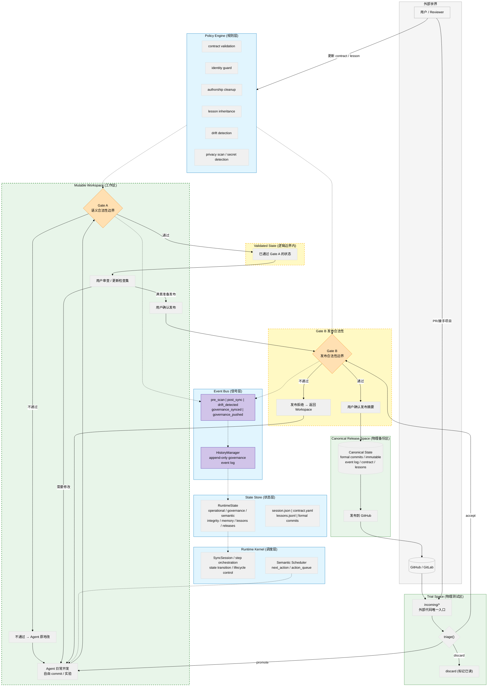

# Gitgo

**Development Semantic Runtime** — AI 协作开发过程中的项目状态治理系统。

334 个测试 | 43 个 MCP 工具 | 22 个 CLI 模式 | v0.27

---

## 不是什么

不是一个 Git GUI。不是一个 CI/CD。不是一个 agent 外挂。

**是一个运行在 workspace 内部的状态治理层**——在 Agent 写完代码和代码被发布之间，提供不可跳过的合法性边界。

---

## 架构



---

## 能力

### 工作流

| 功能 | CLI | MCP |
|------|-----|-----|
| `scan` — 文件变更扫描（SHA256 + EOL 归一化） | ✅ | ✅ |
| `formalize` — workspace commit → formal commit 聚合 | ✅ | ✅ |
| `sync` — 同步到 release 仓库（Gate A 拦截） | ✅ | ✅ |
| `push` — 推送至 GitHub（Gate B） | ✅ | ✅ |
| `trial` — 外部代码 triage（accept/promote/discard） | ✅ | ✅ |
| `daemon` — 持久守护进程（watchdog + trial 轮询 + Policy Engine） | ✅ | — |
| `dashboard` — 实时项目状态面板 | ✅ | — |

### 治理

| 系统 | 说明 |
|------|------|
| **Identity Guard** | 全量覆盖检测 / 身份文件删除告警 / 目录骨架崩塌检测 |
| **Memory Snapshot** | sync 时自动快照 `.claude/` `.codex/` `.codebuddy/` → backup |
| **Project Contract** | 项目合约自动维护 + push 前漂移检测（功能删除/技术栈漂移/架构违反） |
| **Lesson System** | 抽象层+实例层知识传承，sync 后自动收割（CLAUDE.md + git log + governance signals） |
| **Authorship** | push 前 AI 痕迹清洗（commit message + 代码注释 + AI 配置文件排除） |
| **Template System** | 多套命名 commit message 模板，`str.format()` 8 变量填充 |
| **Discipline** | 8 条 Runtime Constitution 规则 + 三层状态机 |

### 9 种 Governance Event

`governance_synced` / `governance_pushed` / `governance_dissolved` / `governance_edited` / `governance_renumbered` / `governance_drift` / `governance_contract_updated` / `governance_lesson` / `governance_memory_snapshot`

全部写入 append-only HistoryManager。

---

## 快速开始

```bash
pip install -r requirements.txt

# 自举配置（把 gitgo 自己注册为项目）
python -m gitgo --mode bootstrap

# 实时 dashboard
python -m gitgo --mode dashboard --refresh 5

# Agent 交付检查
# MCP: gitgo_round_complete(project="myproject")

# 发布
python -m gitgo --mode push --project myproject --strip-authorship
```

---

## 项目结构

```
gitgo/
├── backend/                   # 引擎层
│   ├── core/                  #   Runtime Kernel + State Store + Policy Engine
│   │   ├── sync_session.py    #   状态机（18 step_* 方法）
│   │   ├── state_reader.py    #   统一状态查询
│   │   ├── config.py          #   项目配置
│   │   ├── history.py         #   HistoryManager (append-only event log)
│   │   ├── governance/        #   quality / patterns / graph / releases
│   │   ├── identity/          #   guard (完整性检测) + snapshot (记忆快照)
│   │   ├── knowledge/         #   lesson (知识传承)
│   │   ├── operations/        #   scan / git / sync / security / diff
│   │   ├── daemon/            #   持久守护进程
│   │   ├── contract.py        #   项目合约 + 漂移检测
│   │   ├── authorship.py      #   AI 痕迹清洗
│   │   └── template_manager.py #  commit 模板系统
│   ├── adapters/              #   Local / SSH / SMB 三实现
│   ├── models/                #   数据模型
│   └── remote/                #   GitHub / GitLab API
├── cli/                       # CLI verbs + dashboard
├── mcp_server.py              # FastMCP server (43 tools)
├── frontend/                  # Qt GUI
├── cui/                       # Rich 终端界面
├── tests/                     # 334 测试 + 1 skip
└── docs/                      # RuntimeConstitution / HANDOFF / VERSION
```

---

## 版本

| 版本 | 里程碑 |
|------|--------|
| v0.10–v0.20 | P1–P4: Foundation + Governance |
| v0.21 | P5: Protocol & Ecosystem |
| v0.22 | P6: Template + SMB + CLI/MCP |
| v0.23 | Identity Guard |
| v0.24 | Authorship + Contract + Lesson |
| v0.25 | State Convergence (C1–C3) |
| v0.26 | Runtime Discipline |
| **v0.27** | **Constitution + Policy Engine daemon + Dashboard + MCP gate** |
