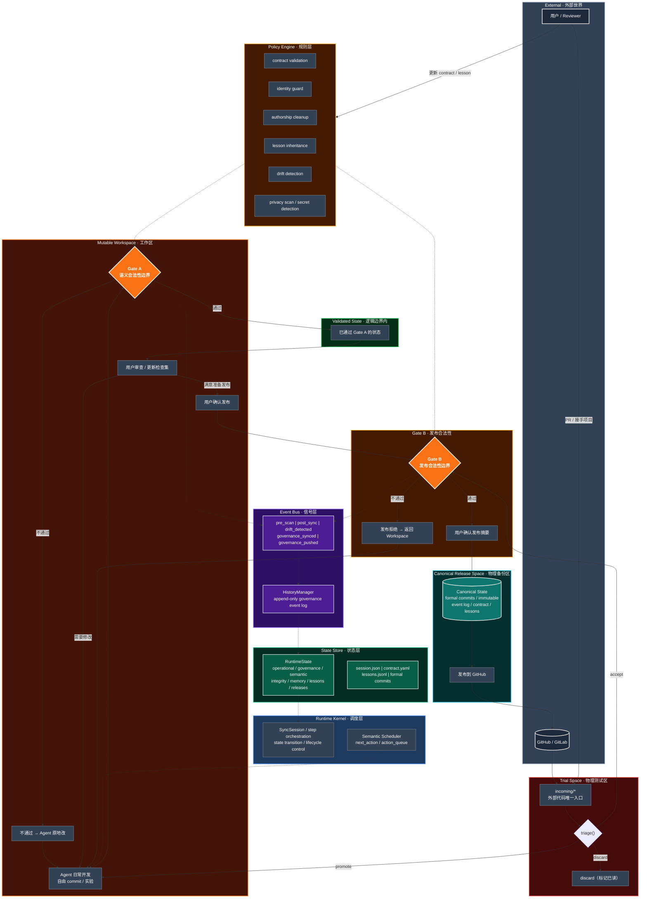

# Gitgo

**Development Semantic Runtime** — AI 协作开发过程中的项目状态治理系统。

334 个测试 | 43 个 MCP 工具 | 22 个 CLI 模式 | v0.27

---

## 是什么

**Gitgo 是一个 Development Semantic Runtime**——运行在 workspace 内部，治理 AI 协作开发过程中项目状态。

### 机制层

- **Gate A（语义合法性边界）**：Agent 写完后、代码交给用户之前的检查点。contract 约束 / lesson 继承 / drift 检测 / identity guard 全部在此执行。不通过则 Agent 原地修改，通过才通知用户。
- **Gate B（发布合法性边界）**：用户确认发布后、代码进入 Canonical Release Space 之前的检查点。authorship 清洗 / 隐私扫描 / 安全检测在此执行。
- **Policy Engine（常驻规则引擎）**：daemon 内置，watchdog 检测到文件变更时自动运行。不依赖 Agent 调用，检查结果写入 append-only HistoryManager。
- **Semantic Scheduler**：`suggested_next_action` / `action_queue` 从 governance 层推导。当前只输出建议，不驱动实际调度（待 Phase D）。

### 当前理论困境

Gitgo 的强制力模型依赖于一个前提：**Agent 的所有输出最终必须经过一个 Gate 才能离开 workspace**。这个前提在以下情况下成立：

- **Git 路径**：Agent 的 workspace commit 要进入 release 仓库，只有 gitgo sync → push 一条路。Gate A 和 Gate B 拦截在 sync 和 push 之前，Agent 无法绕过。

- **文件系统路径**：daemon 的 Policy Engine 通过 OS filesystem watchdog 检测到文件变更后自动运行检查，不依赖 Agent 调用。Agent 无法阻止这个检查。

但以下情况**不成立**：

- **Agent 框架不提供可挂载的强制拦截接口**。Claude Code 的 hook 机制仅限于 pre-commit / post-commit 等 git 事件，没有 "pre-agent-action" 或 "post-agent-reasoning" 级别的拦截点。Gitgo 的 Policy Engine 可以检测到 Agent 的每一次文件变更，但不能在 Agent 执行下一步推理之前**强制暂停**它。

- **MCP tool 依赖 Agent 主动调用**。`gitgo_round_complete()` 是机制上正确的闸口——Agent 必须收到 `passed: true` 才能确认本轮完成。但 Agent 可以选择不调。MCP 协议本身没有 "tool 必须被调用" 的语义。

- **跨进程边界不可逾越**。Gitgo 和 Agent 是两个独立进程。在没有 Agent 框架提供的进程间同步原语的情况下，Gitgo 能做到的上限是**Gate A 在 sync 时的历史审计**——Agent 绕不过去（release pipeline 只有这一条路），但不是在犯规的当时拦住。

**当前实际效果**：Gitgo 在 release pipeline 入口（sync）提供不可跳过的检查。在 workspace 内部，Policy Engine 提供实时信号但不强制 Agent 响应。完全实时拦截需要 Agent 框架开放进程内的 hook 接口——这是 gitgo 自身无法解决的依赖。

## 架构



---

## 能力

### 工作流

| 功能 | CLI | MCP |
|------|-----|-----|
| `scan` — 文件变更扫描（SHA256 + EOL 归一化） | ✅ | ✅ |
| `formalize` — workspace commit → formal commit 聚合 | ✅ | ✅ |
| `sync` — 同步到 release 仓库（Gate A 拦截） | ✅ | ✅ |
| `push` — 推送至 GitHub（Gate B） | ✅ | ✅ |
| `trial` — 外部代码 triage（accept/promote/discard） | ✅ | ✅ |
| `daemon` — 持久守护进程（watchdog + trial 轮询 + Policy Engine） | ✅ | — |
| `dashboard` — 实时项目状态面板 | ✅ | — |

### 治理

| 系统 | 说明 |
|------|------|
| **Identity Guard** | 全量覆盖检测 / 身份文件删除告警 / 目录骨架崩塌检测 |
| **Memory Snapshot** | sync 时自动快照 `.claude/` `.codex/` `.codebuddy/` → backup |
| **Project Contract** | 项目合约自动维护 + push 前漂移检测（功能删除/技术栈漂移/架构违反） |
| **Lesson System** | 抽象层+实例层知识传承，sync 后自动收割（CLAUDE.md + git log + governance signals） |
| **Authorship** | push 前 AI 痕迹清洗（commit message + 代码注释 + AI 配置文件排除） |
| **Template System** | 多套命名 commit message 模板，`str.format()` 8 变量填充 |
| **Discipline** | 8 条 Runtime Constitution 规则 + 三层状态机 |

### 9 种 Governance Event

`governance_synced` / `governance_pushed` / `governance_dissolved` / `governance_edited` / `governance_renumbered` / `governance_drift` / `governance_contract_updated` / `governance_lesson` / `governance_memory_snapshot`

全部写入 append-only HistoryManager。

---

## 快速开始

```bash
pip install -r requirements.txt

# 自举配置（把 gitgo 自己注册为项目）
python -m gitgo --mode bootstrap

# 实时 dashboard
python -m gitgo --mode dashboard --refresh 5

# Agent 交付检查
# MCP: gitgo_round_complete(project="myproject")

# 发布
python -m gitgo --mode push --project myproject --strip-authorship
```

---

## 项目结构

```
gitgo/
├── backend/                   # 引擎层
│   ├── core/                  #   Runtime Kernel + State Store + Policy Engine
│   │   ├── sync_session.py    #   状态机（18 step_* 方法）
│   │   ├── state_reader.py    #   统一状态查询
│   │   ├── config.py          #   项目配置
│   │   ├── history.py         #   HistoryManager (append-only event log)
│   │   ├── governance/        #   quality / patterns / graph / releases
│   │   ├── identity/          #   guard (完整性检测) + snapshot (记忆快照)
│   │   ├── knowledge/         #   lesson (知识传承)
│   │   ├── operations/        #   scan / git / sync / security / diff
│   │   ├── daemon/            #   持久守护进程
│   │   ├── contract.py        #   项目合约 + 漂移检测
│   │   ├── authorship.py      #   AI 痕迹清洗
│   │   └── template_manager.py #  commit 模板系统
│   ├── adapters/              #   Local / SSH / SMB 三实现
│   ├── models/                #   数据模型
│   └── remote/                #   GitHub / GitLab API
├── cli/                       # CLI verbs + dashboard
├── mcp_server.py              # FastMCP server (43 tools)
├── frontend/                  # Qt GUI
├── cui/                       # Rich 终端界面
├── tests/                     # 334 测试 + 1 skip
└── docs/                      # RuntimeConstitution / HANDOFF / VERSION
```

---

## 版本

| 版本 | 里程碑 |
|------|--------|
| v0.10–v0.20 | P1–P4: Foundation + Governance |
| v0.21 | P5: Protocol & Ecosystem |
| v0.22 | P6: Template + SMB + CLI/MCP |
| v0.23 | Identity Guard |
| v0.24 | Authorship + Contract + Lesson |
| v0.25 | State Convergence (C1–C3) |
| v0.26 | Runtime Discipline |
| **v0.27** | **Constitution + Policy Engine daemon + Dashboard + MCP gate** |
