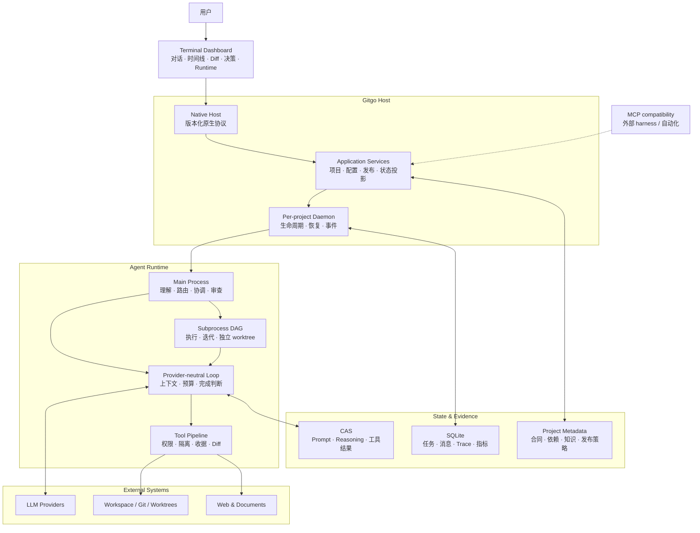

# Gitgo

Gitgo 是一个为真实项目工作设计的终端 Agent harness。它不只提供一个对话框，而是把任务理解、工具执行、多人协作式 Agent 流程、权限决策、质量验证、上下文管理和长期项目状态组织成一条可观察、可恢复的工作链。

当前版本是 Windows Terminal Preview。正式产品界面使用 Bun、React 与 Ink；Python Native Host 在后台管理 Provider、Agent runtime、工具和持久化状态。

[下载 Windows Terminal Preview](https://github.com/Truman-Duo/Gitgo/releases/tag/terminal-preview-2026-09-28) · [安装与启动](docs/INSTALL.md) · [贡献指南](CONTRIBUTING.md) · [Open Issues](https://github.com/Truman-Duo/Gitgo/issues)

## Gitgo 能做什么

- **持续完成项目任务**：支持对话、文件读写、搜索、Shell、文档处理、网络检索、Diff 和自定义工具，而不是止步于生成建议。
- **动态组织 Main Process / Subprocess**：Main Process 负责理解用户、路由、协调和审查；复杂工作可交给长期存在、可继续迭代的 Subprocess，并通过 DAG、接口合同和 worktree 协作。
- **让执行过程可见**：终端时间线展示阶段进展、思考、工具、权限、问题、Diff、上下文占用和最终结果；Verbose 只控制展开程度，不改变事实。
- **把治理做成运行时能力**：任务合同、权限、测试证据、完成判断、错误恢复和取消由 Host 执行，模型不能用一段文字伪造完成。
- **支持长会话和长期项目**：上下文压缩、spill 取回、知识收割、依赖证据、跨 Daemon 恢复以及 SQLite/CAS 状态存储共同维护连续性。
- **适配不同模型服务**：同一 Agent loop 可连接 OpenAI Responses、OpenAI Chat Completions 和 Anthropic Messages 风格的 Provider。

## 架构一览


```mermaid
flowchart TB
    User["用户"] --> UI["Terminal Dashboard<br/>对话 · 时间线 · Diff · 决策 · Runtime"]

    subgraph Host["Gitgo Host"]
        Native["Native Host<br/>版本化原生协议"]
        Services["Application Services<br/>项目 · 配置 · 发布 · 状态投影"]
        Daemon["Per-project Daemon<br/>生命周期 · 恢复 · 事件"]
    end

    subgraph Runtime["Agent Runtime"]
        Main["Main Process<br/>理解 · 路由 · 协调 · 审查"]
        Subs["Subprocess DAG<br/>执行 · 迭代 · 独立 worktree"]
        Loop["Provider-neutral Loop<br/>上下文 · 预算 · 完成判断"]
        Tools["Tool Pipeline<br/>权限 · 隔离 · 收据 · Diff"]
    end

    subgraph Evidence["State & Evidence"]
        State["SQLite<br/>任务 · 消息 · Trace · 指标"]
        CAS["CAS<br/>Prompt · Reasoning · 工具结果"]
        Project["Project Metadata<br/>合同 · 依赖 · 知识 · 发布策略"]
    end

    subgraph External["External Systems"]
        Providers["LLM Providers"]
        Workspace["Workspace / Git / Worktrees"]
        Web["Web & Documents"]
    end

    UI --> Native --> Services --> Daemon --> Main
    Main --> Loop
    Main --> Subs --> Loop
    Loop <--> Providers
    Loop --> Tools
    Tools --> Workspace
    Tools --> Web
    Daemon <--> State
    Loop <--> CAS
    Services <--> Project

    MCP["MCP compatibility<br/>外部 harness / 自动化"] -.-> Services
```

Dashboard 的默认数据面是原生协议，MCP 只是面向其他 harness 和自动化工具的受限兼容入口。更完整的组件职责与协作约束见 [架构说明](docs/ARCHITECTURE.md)。

## 已经完成的工作

截至 2026-09-28，Gitgo 已完成：

- 原生 Dashboard → Native Host → Daemon → Provider → Tool 主链；
- Main Process / Subprocess DAG、独立 linked worktree、审查与拓扑晋升；
- 三种 Provider 协议适配、流式响应、Reasoning/工具续接与能力探针；
- 文件、Shell、文档、联网和可持久化自定义工具底座；
- 上下文装配/压缩、缓存遥测、知识与依赖证据；
- 跨 Daemon 显式恢复、强取消、结构化错误和用户决策卡；
- SQLite/CAS 单一权威状态、写入预算、恢复工具和隐私发布门；
- Windows staging 构建和 GitHub prerelease。

本次发布快照通过 1084 项 Python 测试（1 项跳过）和 135 项 Dashboard 测试，并完成生产构建。真实 Provider 验收覆盖过多步工具、动态工具、Subprocess、worktree、知识收割和错误恢复；这些结果表示主链已运行，不代表所有 Provider 和平台均已达到稳定版标准。

## 开始使用

### 使用预览包

从 [Releases](https://github.com/Truman-Duo/Gitgo/releases) 下载 Windows x64 ZIP 和对应 SHA-256 文件，校验后完整解压，再运行 `gitgo.exe`。不要把它单独移出包内目录；内部 Native Host 是同一产品的一部分。

### 从源码启动

```text
run_dashboard_native.bat
```

该入口启动完整 Bun/Ink Dashboard。浏览器 smoke 页面、mock 页面和 trace-only renderer 只用于诊断，不能替代正式终端。

开发环境、Provider 配置和构建流程分别见：

- [安装与启动](docs/INSTALL.md)
- [Provider 与项目配置](docs/CONFIGURATION.md)
- [贡献与提交规范](CONTRIBUTING.md)
- [安全与隐私](docs/SECURITY_AND_PRIVACY.md)
- [已知限制](docs/KNOWN_ISSUES.md)

## 项目状态

Gitgo 目前是 Terminal Preview，而不是稳定版。近期工作集中在 Provider failover/circuit breaker、前端体验、提示词体系、审批模式、原生沙箱和发布自动化。路线图与缺陷统一维护在 [GitHub Issues](https://github.com/Truman-Duo/Gitgo/issues)。
