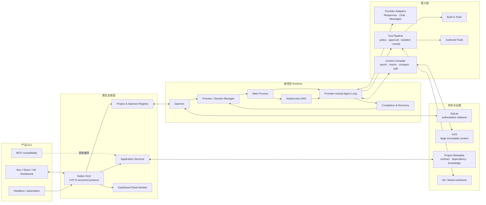
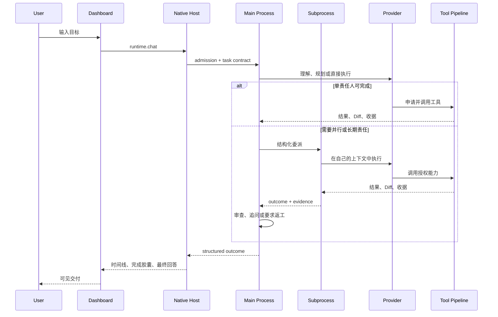

# Gitgo 架构

Gitgo 是一个本地优先的终端 Agent harness。用户只面对一个 Dashboard；Native Host、Daemon、Provider adapter、工具和存储是同一产品内部的协作层。

## 系统拓扑



## 一条任务如何运行



## 组件职责

| 组件 | 负责 | 不负责 |
|---|---|---|
| Dashboard | 输入、导航、时间线、Diff、决策、配置与运行时投影 | 直接访问 Provider、解释治理真相 |
| Native Host | 协议、应用服务、项目/Daemon 所有权、稳定错误边界 | 生成模型答案 |
| Daemon | 每项目生命周期、事件、恢复、任务运行时 | 跨项目 UI 状态 |
| Main Process | 对齐用户、动态路由、协调、审查和交付 | 无条件亲自执行所有工作 |
| Subprocess | 负责一个可持续迭代的任务域或工作流节点 | 绕过 Main Process 私聊其他 Subprocess |
| Agent Loop | Provider-neutral 消息/工具循环、预算和上下文 | 把 Provider 特有格式扩散给其他层 |
| Tool Pipeline | schema、权限、隔离、取消、Diff 和收据 | 根据自然语言猜测用户授权 |
| SQLite/CAS | 关系真相、不可变大对象、恢复和审计 | 逐 token/动画帧高频落盘 |

## Main Process 与 Subprocess

路由是动态的，不是“每个任务都开 Subprocess”或“默认禁止 Subprocess”的固定阈值：

- 短且单一的任务由 Main Process 申请自执行能力完成；
- 一开始就复杂、需要并行、独立审查或持续责任的任务创建 Subprocess；
- 任务在执行中变复杂时，可以把已有事实、合同和工作区责任交接给 Subprocess；
- 同一部件的连续修改优先回到原 Subprocess，而不是每轮新建；
- Subprocess 之间通过接口合同、依赖事件和 Main Process 协调，不开放不可审计私聊。

## 上下文模型

Provider 可见请求按稳定性组织：

```text
稳定 ROM / 能力合同
→ 任务生命周期内稳定的 Task Contract
→ append-only 会话事件
→ 本轮动态 envelope
→ 当前用户输入
```

大对象进入可寻址存储并按需物化；重复引用由 session memo 去重；上下文达到水位时建立新的 `context_epoch`。压缩不会获得修改历史事实的权力。

## 状态与恢复

- SQLite 保存 session、task、process、message、receipt、governance、usage 和投影关系；
- CAS 保存 Prompt、Reasoning、工具结果等较大不可变内容；
- Git common dir 保存稳定项目身份，使 linked worktree 共享同一项目；
- Daemon 重启后由持久状态重建任务树，但不自动重放无法证明是否产生副作用的操作；
- 高频 token delta、网络帧和 UI 动画不会逐条写入 SQLite。

## 协议边界

Dashboard 默认通过版本化原生协议连接 Native Host。MCP 仅服务于外部 harness 和自动化适配，不是 Dashboard 的降级数据面。Provider adapter 把 OpenAI Responses、OpenAI Chat Completions 和 Anthropic Messages 映射到统一事件模型。

## 仍在演进的部分

workspace、trial、formal 的多人、多仓库协作模型与上下游同步/并发边界见 [协作设计](collaboration-workflow.md)。角色不限定物理仓库数量；该设计的自动生命周期尚未实现，当前贡献者按 [贡献规范](../CONTRIBUTING.md) 提交候选。

自动 Provider failover/circuit breaker、原生沙箱、Node.js 兼容路径、跨机器 backend、其他平台发行包和桌面端仍在路线图中。以 [Open Issues](https://github.com/Truman-Duo/Gitgo/issues) 为准，不把规划描述成已经实现。
